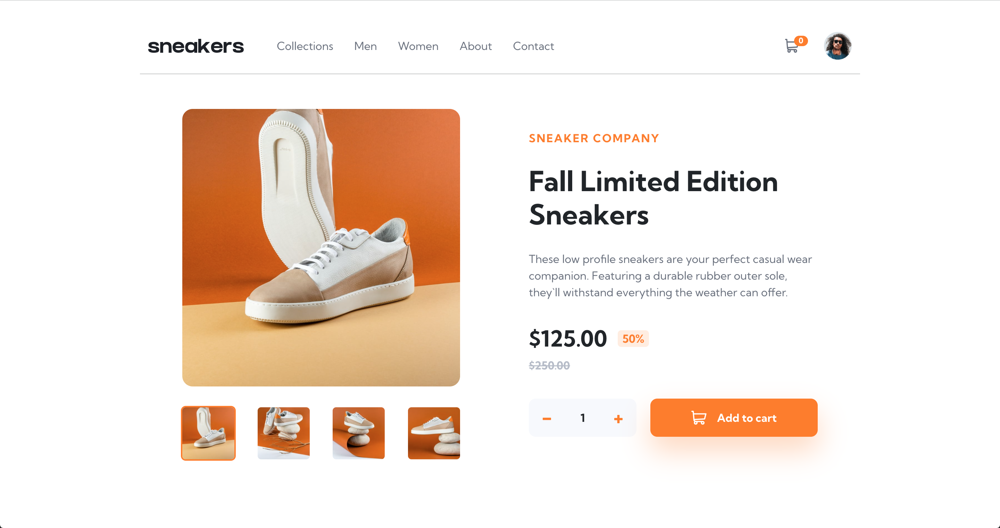

# Frontend Mentor - E-commerce product page solution

This is a solution to the [E-commerce product page challenge on Frontend Mentor](https://www.frontendmentor.io/challenges/ecommerce-product-page-UPsZ9MJp6). Frontend Mentor challenges help you improve your coding skills by building realistic projects.

## Table of contents

- [Overview](#overview)
  - [The challenge](#the-challenge)
  - [Screenshot](#screenshot)
  - [Links](#links)
- [My process](#my-process)
  - [Built with](#built-with)
  - [What I learned](#what-i-learned)
  - [Continued development](#continued-development)
  - [Useful resources](#useful-resources)
- [Author](#author)
- [Acknowledgments](#acknowledgments)

## Overview

### The challenge

Users should be able to:

- View the optimal layout for the site depending on their device's screen size
- See hover states for all interactive elements on the page
- Open a lightbox gallery by clicking on the large product image
- Switch the large product image by clicking on the small thumbnail images
- Add items to the cart
- View the cart and remove items from it

### Screenshot



### Links

- Solution URL: [](https://www.frontendmentor.io/solutions/ecommerce-product-page-with-react-cFHbwSVxxM)
- Live Site URL: [](https://alfiemitchell123.github.io/Ecommerce-Page/)

## My process

### Built with

- [React](https://reactjs.org/) - JS library
- CSS custom properties
- Flexbox

### What I learned

I learned a lot about using React in this project. This is the time I've used React in a project, so getting started was a bit difficult, but I was able to quickly adapt and build a functional ecommerce site.

I liked how easy it was to manipulate data stored in other components. The code below is taken from the Cart.js component. Using the map function, I was able to map out the items the user has stored in the cart, convert them to a list, and stylise it to create the cart function displayed in the screenshot below.

```js
<ul id="cartItemList">
  {cartItems.map(cartItem => {
      const product = products.find(product => product.id === cartItem.productId);
      if (product) {
          return (
              <div>
                  <li class="cartItem" key={product.id}>
                      
                      <div id="cartItemInfo">
                      <p id="cartProductTitle">{product.name}</p>
                          <p id="cartProductPrice">${(product.price).toFixed(2)} x {cartItem.quantity} <b>${(product.price * cartItem.quantity).toFixed(2)}</b></p>
                      </div>
                      
                  </li>
                  <div className="checkoutBtnContainer">
                      <button id="checkoutBtn" className="addToCartBtn">Checkout</button>
                  </div>
              </div>
          );
      } else {
          return null;
      }
  })}
</ul>
```


### Continued development

For my next project and thereforth, I would like to continue my React development, while learning how to integrate other libraries and frameworks to help speed up the process. So I didn't get too sidetracked with this project, I used plain CSS, but I would love to use Tailwind or SCSS in the future.

### Useful resources

- I find it helpful to use ChatGPT when struggling with aspects of the project. It can be easy to get carried away, and let it write your entire project for you. But to speed up the development, while learning along the way, it can be an incredibly helpful tool.

- I also find it helpful to find others solutions to the same project on Frontend Mentor, and using Chrome Developer Tools, inspect areas of the project that you're struggling with. I try not to directly copy code, but to learn what to do and what not to do from other developers' projects can be really useful in your own development.

## Author

- Frontend Mentor - [@alfiemitchell123](https://www.frontendmentor.io/profile/alfiemitchell123)

## Acknowledgments

- Inspiration - [](https://www.frontendmentor.io/solutions/ecommerce-product-page-using-react-VYvuqIydra)
                [](https://github.com/SaraMajeed/ecommerce-product-page)